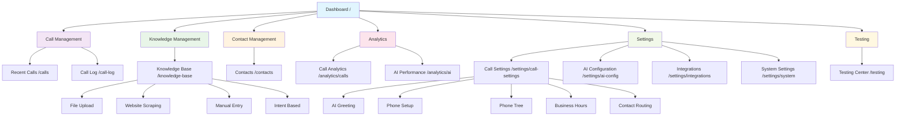
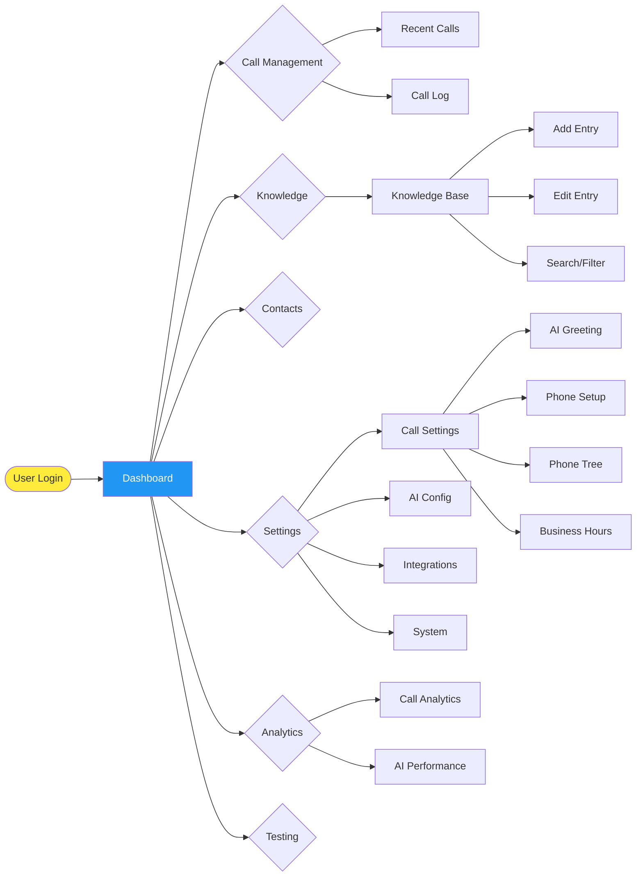
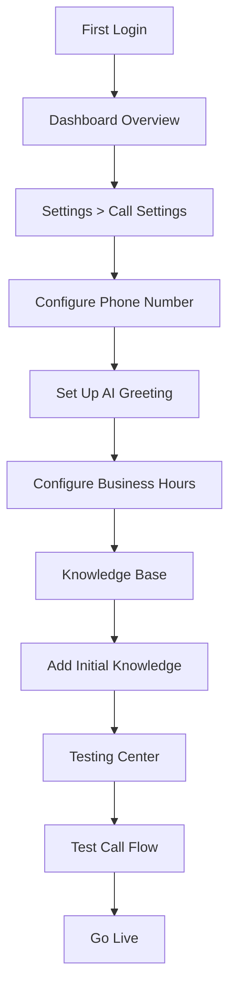
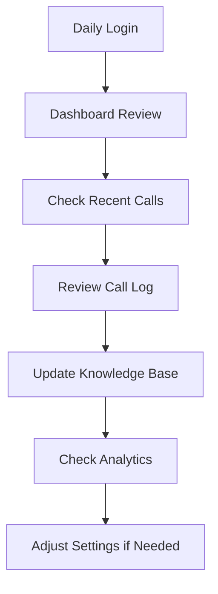

# AI Call Assistant - Site Map Flowchart

## Visual Site Structure



## Navigation Flow



## User Journey Flows

### Setup Flow (New User)


### Daily Operations Flow


## Information Architecture

```
AI Call Assistant Platform
│
├── 📊 Dashboard (Home)
│   ├── Quick Stats
│   ├── Recent Activity
│   ├── Live Monitoring
│   └── Quick Actions
│
├── 📞 Call Operations
│   ├── Recent Calls
│   │   ├── Call List
│   │   ├── Quick Actions
│   │   └── Status Updates
│   │
│   └── Call Log
│       ├── Advanced Search
│       ├── Filters & Sorting
│       ├── Transcriptions
│       ├── AI Analysis
│       └── Export Options
│
├── 🧠 Knowledge Management
│   └── Knowledge Base
│       ├── Entry Management
│       │   ├── Create New
│       │   ├── Edit Existing
│       │   └── Delete Entries
│       │
│       ├── Content Sources
│       │   ├── File Upload
│       │   ├── Website Scraping
│       │   ├── Manual Entry
│       │   └── Intent-Based
│       │
│       └── Organization
│           ├── Categories/Tags
│           ├── Search & Filter
│           └── Confidence Levels
│
├── 👥 Contact Operations
│   └── Contacts
│       ├── Contact List
│       ├── Contact Details
│       ├── VIP Management
│       ├── Contact Sync
│       └── Routing Preferences
│
├── 📈 Analytics & Reporting
│   ├── Call Analytics
│   │   ├── Volume Trends
│   │   ├── Response Times
│   │   ├── Success Rates
│   │   └── Satisfaction Metrics
│   │
│   └── AI Performance
│       ├── Confidence Trends
│       ├── Knowledge Usage
│       ├── Response Accuracy
│       └── Learning Progress
│
├── ⚙️ System Configuration
│   ├── Call Settings
│   │   ├── AI Greeting Setup
│   │   ├── Phone Configuration
│   │   ├── Phone Tree Design
│   │   ├── Business Hours
│   │   └── Contact Routing
│   │
│   ├── AI Configuration
│   │   ├── Response Templates
│   │   ├── Confidence Thresholds
│   │   ├── Personality Settings
│   │   └── Learning Preferences
│   │
│   ├── Integration Management
│   │   ├── Communication Tools
│   │   │   ├── Slack
│   │   │   ├── Microsoft Teams
│   │   │   └── Zoom
│   │   │
│   │   ├── CRM Systems
│   │   │   ├── Salesforce
│   │   │   ├── HubSpot
│   │   │   └── Custom APIs
│   │   │
│   │   └── Automation
│   │       ├── Zapier
│   │       └── Webhooks
│   │
│   └── System Settings
│       ├── User Management
│       ├── Security Settings
│       ├── Notifications
│       └── System Monitoring
│
└── 🧪 Development Tools
    └── Testing Center
        ├── Conversation Simulation
        ├── Response Testing
        ├── Call Flow Validation
        └── Performance Benchmarks
```

## Breadcrumb Patterns

### Pattern Examples
- `Dashboard` (Root level)
- `Call Operations > Recent Calls`
- `Call Operations > Call Log`
- `Knowledge Management > Knowledge Base`
- `Contact Operations > Contacts`
- `Analytics > Call Analytics`
- `Analytics > AI Performance`
- `Settings > Call Settings`
- `Settings > AI Configuration`
- `Settings > Integration Management`
- `Settings > System Settings`
- `Development Tools > Testing Center`

### Navigation Context
Each breadcrumb level is clickable and provides:
- Quick navigation to parent sections
- Context awareness of current location
- Visual hierarchy representation
- Back navigation functionality